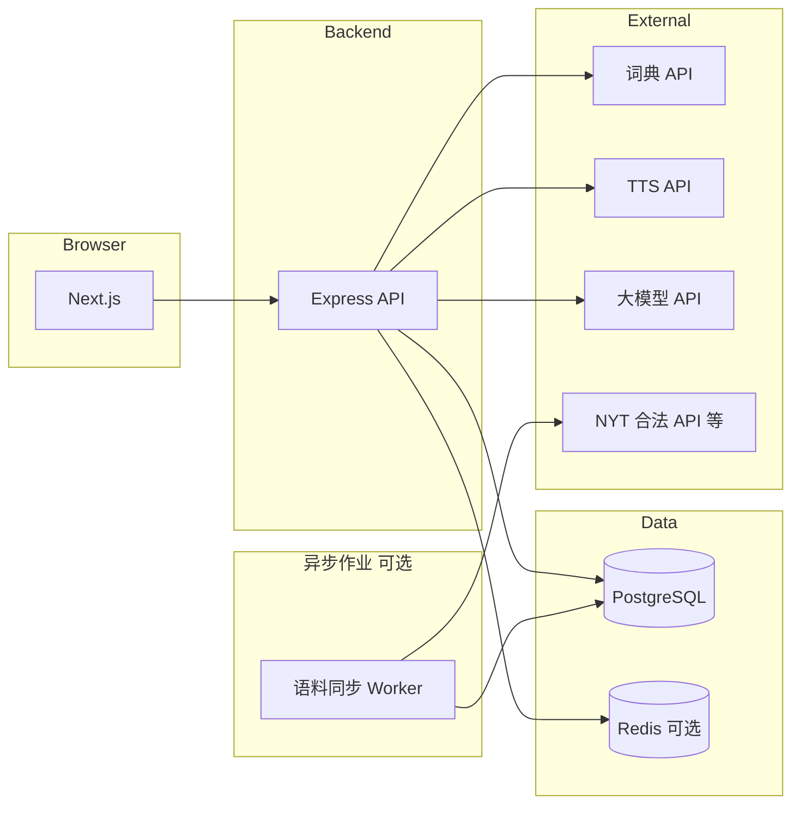

# 英语单词记忆网站 — 技术文档

> **关联文档**：[项目设计文档](./项目设计文档.md)（产品目标、设计系统方案 B、功能边界与非功能选型原则）。  
> **本文定位**：实现层约定 — 架构、数据模型、接口契约、鉴权、时区与打卡逻辑、语料与第三方集成、部署与环境变量。OpenAPI 机器可读文件建议单独维护为 `openapi.yaml`（或仓库 `contracts/` 目录），与下文章节保持同步。

---

## 一、技术栈与仓库形态（默认）

| 层级 | 选型 | 说明 |
|------|------|------|
| 前端 | **Next.js（App Router）+ TypeScript + React** | 与设计文档默认路线一致；页面级 SSR/SSG 按需启用；**L1 玻璃拟态实现细则见第二节** |
| 后端 | **Node.js + Express + TypeScript** | REST API；与 Next 可同仓（monorepo）或分仓，由团队定稿 |
| 数据库 | **PostgreSQL 14+** | 主存；JSONB 承载可变词典原始响应 |
| 缓存 / 限流（推荐） | **Redis 7+** | 限流、会话黑名单、热点词缓存（可选阶段引入） |
| 契约 | **OpenAPI 3.1** | 单一事实来源；前端用 Orval/ openapi-typescript 生成类型 |

**建议目录结构（monorepo 示例）**

```text
apps/web          # Next.js
apps/api          # Express
packages/shared   # 共享 Zod schema / 常量
contracts/openapi.yaml
```

---

## 二、前端视觉与玻璃拟态实现（参考实例图）

> **对照说明**：本节对应《项目设计文档》**设计系统方案 B 的 L1 主学习流**（浅色、高模糊、紫丁香/深紫强调色）。你提供的参考图呈现的是典型的 **iOS / Apple 系质感玻璃拟态**：大面积半透明层、强 `backdrop-filter`、细高亮描边、柔和弥散阴影与渐变数据可视化。L2 深色打卡区仍按技术文档其他章节与产品文档实现，外层可用玻璃卡片「包裹」深色面板以统一层级。

### 2.1 视觉语言拆解（从参考图抽象为可编码规范）

| 维度 | 参考图特征 | 前端落地要点 |
|------|-------------|----------------|
| **空间层次** | 背景渐变 + 漂浮模糊球体；前景多层玻璃卡片叠放 | 背景单独一层（`fixed` 或页面根）；装饰球 `position: absolute` + `filter: blur()`；内容卡片 `z-index` 分层 |
| **玻璃面板** | 高透白/灰、背后色相透出 | `background: rgba(255,255,255,0.12–0.28)` 或略偏蓝紫的 `rgba(248,250,255,0.2)`；**必须**配合 `backdrop-filter: blur(16px–28px) saturate(140%–180%)`** |
| **边缘光** | 细白边、似光线掠过玻璃棱线 | `border: 1px solid rgba(255,255,255,0.25–0.45)`；可选 `box-shadow: inset 0 1px 0 rgba(255,255,255,0.35)` 做上沿高光 |
| **体积感** | 卡片略「浮起」 | 外阴影：`0 8px 32px rgba(80,60,120,0.12–0.2)`，避免纯黑大阴影 |
| **强调色** | 粉—紫、蓝—紫线性渐变用于图表与主按钮 | 使用 **CSS 变量**统一 `--accent-from` / `--accent-to`；图表柱顶圆角、环形进度用 `conic-gradient` 或 SVG |
| **文字** | 标题深紫/白字反色；次级说明降低对比 | 玻璃上正文用 `color: rgba(30,20,60,0.85)` 或浅底用深紫；圆形仪表中心可用纯白大字 |
| **图标** | 细线、极简 | 统一 `stroke-width: 1.5–2`；Lucide / Heroicons 线性风格 |
| **控件** | 实心白按钮、开关带微发光 | 主 CTA：`background: #fff` + 轻阴影；`Switch` 开启态加 `box-shadow: 0 0 12px var(--accent-glow)` |

### 2.2 与本项目功能的组件映射（实例图 → 英语记忆站）

| 参考图模块 | 本项目用途 |
|------------|------------|
| **圆角柱状图** | **单词掌握量进步折线/柱形图**（可与 `GET /stats/mastery-series` 数据绑定；移动端柱图更贴近参考图） |
| **半环/圆环仪表** | **当日背诵目标完成比例**或「今日已学时长 / 目标」 |
| **列表行 + 分割线** | **打卡历史**、**最近复习词条** |
| **设置列表 + Toggle** | 时区、提醒时间、音效开关等 |
| **顶栏图标** | 通知、个人中心；保持 44px 左右触控热区（移动端） |

### 2.3 CSS 实现核心（不绑定特定 UI 库）

**（1）玻璃卡片基类（建议抽成 utility 或 CSS Module）**

```css
.glass-panel {
  position: relative;
  border-radius: 20px; /* 大屏可到 24–28px */
  background: linear-gradient(
    145deg,
    rgba(255, 255, 255, 0.22) 0%,
    rgba(255, 255, 255, 0.08) 100%
  );
  border: 1px solid rgba(255, 255, 255, 0.32);
  box-shadow:
    0 8px 32px rgba(76, 53, 130, 0.15),
    inset 0 1px 0 rgba(255, 255, 255, 0.35);
  backdrop-filter: blur(22px) saturate(160%);
  -webkit-backdrop-filter: blur(22px) saturate(160%);
}
```

**（2）页面氛围背景（渐变 + 装饰球）**

```css
.page-atmosphere {
  min-height: 100dvh;
  background: linear-gradient(
    165deg,
    #e8e4ff 0%,
    #d4e4ff 45%,
    #c9cef5 100%
  );
  position: relative;
  overflow-x: clip;
}
.page-atmosphere::before,
.page-atmosphere::after {
  content: "";
  position: absolute;
  border-radius: 50%;
  filter: blur(60px);
  opacity: 0.55;
  pointer-events: none;
}
/* 具体位置与尺寸按设计稿微调 */
```

**（3）Tailwind（若采用）语义等价示例**

```html
<!-- 仅示意类名组合，数值需与设计 Token 对齐 -->
<div
  class="rounded-[22px] border border-white/30 bg-white/15 shadow-xl shadow-violet-900/10 backdrop-blur-xl backdrop-saturate-150"
>
```

### 2.4 Next.js / React 工程注意点

1. **模糊作用域**：`backdrop-filter` 只对**其后方已绘制内容**生效；避免在玻璃层父级错误使用 `overflow: hidden` 裁掉整块模糊（常见 bug：父级 `overflow-hidden` + 子级 `backdrop-blur` 失效）。可将背景与装饰放在**兄弟层**，玻璃卡片与之间无隔离裁剪问题。  
2. **堆叠上下文**：`transform`、`opacity < 1`、`filter` 会新建层叠上下文；多层玻璃时检查 `z-index` 与 `isolation: isolate` 的使用。  
3. **Safari**：务必写 `-webkit-backdrop-filter`；部分旧版需 `-webkit` 前缀与 `translateZ(0)` 触发合成（按实测决定是否保留 hack）。  
4. **性能**：大区域连续 `blur` 在低端机昂贵；可 `prefers-reduced-motion: reduce` 时减弱 `blur` 或改为实色半透明底。  
5. **可访问性**：玻璃上文字对比度须满足 WCAG（必要时在文字背后加极淡实色衬底 `bg-white/40` 仅包裹文本区）。

### 2.5 图表与「苹果感」数据呈现（实现路径）

| 元素 | 推荐实现 | 说明 |
|------|-----------|------|
| **圆环进度** | SVG `<circle>` + `stroke-dasharray` 或 Recharts `RadialBar` | 轨道用半透明白，进度段用 `linearGradient` 粉—紫 |
| **柱状/折线** | Recharts / Visx / ECharts | 柱顶 `radius={[8,8,0,0]}`；系列色走 Token 渐变 |
| **列表** | 行高宽松、`border-b border-white/10` | 与参考图「交易列表」一致的信息密度控制 |

数据由后端接口提供时，图表组件只消费 `{ date, value }[]`，样式与数据解耦。

### 2.6 设计 Token 建议（写入 `globals.css` 或主题文件）

```css
:root {
  --glass-bg: rgba(255, 255, 255, 0.18);
  --glass-border: rgba(255, 255, 255, 0.35);
  --glass-blur: 22px;
  --accent-violet: #6d28d9;
  --accent-gradient: linear-gradient(135deg, #f472b6, #7c3aed);
  --shadow-float: 0 12px 40px rgba(67, 56, 202, 0.18);
}
```

### 2.7 与方案 B 的 L2 深色区衔接

- 外层：`glass-panel` 包一层 padding。  
- 内层：打卡月历使用深色 `rounded-2xl bg-zinc-900/95`（示例）容器，**内层不再强依赖 `backdrop-filter`**，避免「模糊叠模糊」发灰。  
- 外层玻璃底上仍可透出背景色，形成「浅色座舱内嵌深色仪表」的层次，与参考图中「实体卡片叠在玻璃上」同理。

### 2.8 参考图资源（便于设计对齐）

- 工作区已保存参考截图时，可在设计稿或 README 中引用同路径资源以便评审对齐（文件名以实际 `assets/` 下为准）。

---

## 三、系统架构

### 3.1 逻辑架构



### 3.2 部署拓扑（参考）

- **前端**：Vercel / 静态导出 + CDN / 同机 Nginx 反代 Next。  
- **后端**：容器（Docker）+ 云主机或 PaaS；**HTTPS 终止**在网关或 Nginx。  
- **数据库**：托管 PostgreSQL（自动备份 + PITR）。  
- **密钥**：生产使用云 Secret Manager；本地 `.env` 不入库。

---

## 四、数据模型（PostgreSQL）

以下使用逻辑表名与核心字段；实际迁移可用 Prisma / Drizzle / Knex。时间一律 **`timestamptz`** 存 UTC；「用户日历日」由 **用户 `timezone` + 应用层换算** 得到 `local_date`（`date` 类型）写入聚合表。

### 4.1 `users`

| 字段 | 类型 | 约束 | 说明 |
|------|------|------|------|
| `id` | `uuid` | PK | 全局唯一用户 ID |
| `login` | `text` | UNIQUE | 登录名或邮箱（二选一定稿后加 CHECK） |
| `password_hash` | `text` | NOT NULL | Argon2id / bcrypt |
| `timezone` | `text` | NOT NULL | IANA，如 `Asia/Shanghai` |
| `role` | `text` | NOT NULL DEFAULT `'normal'` | `normal` \| `developer` |
| `created_at` | `timestamptz` | NOT NULL | |
| `updated_at` | `timestamptz` | NOT NULL | |

索引：`login` UNIQUE。开发者账号查询可加部分索引 `WHERE role = 'developer'`（审计用）。

### 4.2 `vocabulary_items`

| 字段 | 类型 | 说明 |
|------|------|------|
| `id` | `uuid` | PK |
| `user_id` | `uuid` | FK → users |
| `lemma` | `text` | 规范词形或小写归一 |
| `raw_input` | `text` | 用户原始输入 |
| `definition_json` | `jsonb` | 词典释义快照（多义项） |
| `mastery_score` | `numeric` 或 `int` | 掌握度加权分（与产品公式一致后固化） |
| `mastery_level` | `smallint` | 可选离散等级 0–5 |
| `created_at` / `updated_at` | `timestamptz` | |

索引：`(user_id, lemma)` UNIQUE 或 `(user_id, lower(lemma))` UNIQUE。

### 4.3 `example_sentences`（用户侧例句缓存）

| 字段 | 类型 | 说明 |
|------|------|------|
| `id` | `uuid` | PK |
| `vocabulary_item_id` | `uuid` | FK |
| `text` | `text` | 例句全文 ≤280 字符（应用层校验） |
| `genre` | `text` | `praise` \| `greeting` \| `question` \| `proverb` 等 |
| `source_attribution` | `text` | `corpus` \| `llm` \| `template` |
| `corpus_sentence_id` | `uuid` | 可空，FK → corpus_sentences |
| `created_at` | `timestamptz` | |

### 4.4 `checkin_sessions`（无暂停）

| 字段 | 类型 | 说明 |
|------|------|------|
| `id` | `uuid` | PK |
| `user_id` | `uuid` | FK |
| `started_at` | `timestamptz` | NOT NULL |
| `ended_at` | `timestamptz` | 可空，进行中为空 |
| `duration_seconds` | `int` | 可空；`ended_at - started_at` 落库便于查询 |
| `status` | `text` | `active` \| `completed` \| `abandoned` | 产品定义「正常结束」为 `completed` |
| `client_meta` | `jsonb` | 可选：UA、前端版本 |

索引：`(user_id, started_at DESC)`。

### 4.5 `daily_checkins`（按用户本地日聚合）

| 字段 | 类型 | 说明 |
|------|------|------|
| `user_id` | `uuid` | |
| `local_date` | `date` | 用户时区下的日历日 |
| `total_seconds` | `int` | 当日会话合计秒数 |
| `completed_session_count` | `int` | |
| `checked_in` | `boolean` | 是否达成当日打卡（规则见第六节） |
| `updated_at` | `timestamptz` | |

主键：`(user_id, local_date)`。

### 4.6 `mastery_events`（折线图数据源）

| 字段 | 类型 | 说明 |
|------|------|------|
| `id` | `uuid` | PK |
| `user_id` | `uuid` | FK |
| `vocabulary_item_id` | `uuid` | 可空；若统计全局掌握量可冗余聚合 |
| `event_type` | `text` | `reviewed` \| `promoted` \| `demoted` 等 |
| `delta` | `int` | 对掌握词条计数或分数的变化量 |
| `local_date` | `date` | 事件发生日（用户时区） |
| `created_at` | `timestamptz` | |

折线图查询：按 `user_id`、`local_date` **GROUP BY** 对 `delta` 或「当日掌握量快照」求和；或在每日定时任务写入 `daily_mastery_stats` 汇总表以降低查询成本。

### 4.7 语料：`corpus_articles` / `corpus_sentences`

与设计文档第五节一致。

**`corpus_articles`**

| 字段 | 类型 | 说明 |
|------|------|------|
| `id` | `uuid` | PK |
| `source` | `text` | 如 `NYT` |
| `external_id` | `text` | 上游 ID |
| `title` | `text` | |
| `published_at` | `date` 或 `timestamptz` | |
| `url` | `text` | 可空 |
| `language` | `text` | 默认 `en` |
| `license_tier` | `text` | `api` \| `public_domain` \| `licensed` |
| `raw_metadata` | `jsonb` | |

唯一：`(source, external_id)`。

**`corpus_sentences`**

| 字段 | 类型 | 说明 |
|------|------|------|
| `id` | `uuid` | PK |
| `article_id` | `uuid` | FK |
| `text` | `text` | |
| `tsv` | `tsvector` | 由 `text` 生成，用于全文检索 |

索引：`GIN(tsv)`；可选 `pg_trgm` 对 `text` 做相似检索。

### 4.8 预留：`refresh_tokens` / `devices`（多端，非 v1 必建）

| 表 | 用途 |
|-----|------|
| `refresh_tokens` | `user_id`、`jti`、`expires_at`、`revoked_at`、`user_agent` |
| `devices` | `device_id`、`user_id`、`last_seen_at` |

v1 若仅用 Session Cookie，可暂缓 `refresh_tokens`，但在迁移脚本中预留注释或空表。

---

## 五、时区与「本地日」计算

### 5.1 原则

- 数据库存 UTC；**不向客户端暴露歧义本地时间字符串作为主键**。  
- 用户修改 `timezone` 时：**不 retroactive 改写**历史 `daily_checkins`（建议在接口层记录 `timezone_changed_at`，新规则仅影响之后日期；或在产品层接受一次「重算」批处理，需单独评审）。

### 5.2 本地日换算（服务端）

- 使用 **IANA TZ Database**（Node：`luxon` / `date-fns-tz` / `Temporal` 草案 polyfill 等）。  
- 给定 UTC 时间 `t` 与用户 `timezone`，计算 `local_date = formatInTimeZone(t, timezone, 'yyyy-MM-dd')`。

### 5.3 打卡日聚合写入时机

- **方案 A（推荐）**：会话 `ended_at` 写入且 `status=completed` 时，在事务内更新 `daily_checkins` 对应 `local_date` 行（`local_date` 由 `ended_at` 换算）。  
- **方案 B**：异步队列消费会话结束事件，幂等更新（`session_id` 去重表）。

---

## 六、打卡与统计业务规则（实现约定）

与设计文档第七节对齐，代码层写死以下默认规则（可配置项单独环境变量）：

1. **无暂停**：`checkin_sessions` 不存 `paused_duration`。  
2. **无最小时长**：不拒绝短会话；是否计入 `checked_in` 仅依赖「是否存在至少一条 `completed` 会话」。  
3. **`checked_in = true`** 当且仅当：该 `local_date` 内 `completed_session_count >= 1`（若产品改为「总时长 > 0」亦可，但需与 PRD 同步）。  
4. **连续天数（Streak）**：按 `local_date` 连续递增计算；可在 `GET /stats/streak` 内实时扫描或维护 `user_streak_cache` 表由日批更新。

**掌握量折线图**

- 默认指标：**按 `local_date` 汇总的「当日净增掌握词条数」**（来自 `mastery_events` 或日表 `daily_mastery_stats`）。  
- API 返回序列：`{ date, value }[]`，日期为 ISO `YYYY-MM-DD`（用户本地日历日）。

---

## 七、REST API 契约（概要）

基路径：`/api/v1`。所有需登录接口携带 **HttpOnly Cookie**（见第八节）。错误体统一：

```json
{
  "error": {
    "code": "STRING_CODE",
    "message": "人类可读说明",
    "details": {}
  }
}
```

### 7.1 认证与用户

| 方法 | 路径 | 说明 |
|------|------|------|
| `POST` | `/auth/register` | body: `login`, `password`, `timezone` |
| `POST` | `/auth/login` | 设置 Cookie；body: `login`, `password` |
| `POST` | `/auth/logout` | 清除 Cookie / 吊销 Refresh（若启用） |
| `GET` | `/users/me` | 当前用户：`id`, `login`, `timezone`, `role` |
| `PATCH` | `/users/me` | 更新 `timezone`、密码等 |

**开发者账号**：`role=developer` 时，可扩展 `GET /debug/health`（仅非生产或 IP 白名单），禁止默认暴露敏感栈信息。

### 7.2 单词库

| 方法 | 路径 | 说明 |
|------|------|------|
| `GET` | `/vocabulary` | 分页、搜索 `q` |
| `POST` | `/vocabulary` | 录入单词；服务端拉词典并落 `definition_json` |
| `GET` | `/vocabulary/:id` | 详情 + 最新例句 |
| `PATCH` | `/vocabulary/:id` | 更新笔记、掌握度等 |
| `DELETE` | `/vocabulary/:id` | 软删除或硬删除（定稿二选一） |
| `POST` | `/vocabulary/:id/examples` | 触发生成例句；返回 `example_sentences` |

### 7.3 发音

| 方法 | 路径 | 说明 |
|------|------|------|
| `GET` | `/vocabulary/:id/audio` | 302 至签名 URL 或返回 `audio_url` JSON |

### 7.4 打卡会话

| 方法 | 路径 | 说明 |
|------|------|------|
| `POST` | `/checkin/sessions` | 开始：`{ "started_at": "ISO8601?" }` 可选，默认服务端 `now()` |
| `PATCH` | `/checkin/sessions/:id/complete` | 结束并标记 `completed`；写 `daily_checkins` |
| `POST` | `/checkin/sessions/:id/abandon` | 放弃，不计入打卡 |

### 7.5 日历与统计

| 方法 | 路径 | 说明 |
|------|------|------|
| `GET` | `/checkin/calendar` | query: `year`, `month`；返回每日 `checked_in`、`total_seconds`、圆点 UI 所需布尔 |
| `GET` | `/stats/streak` | 当前连续天数、最近达标日 |
| `GET` | `/stats/mastery-series` | query: `from`, `to`（`local_date`）；折线图数据 |

### 7.6 语料（内部 / 管理）

| 方法 | 路径 | 说明 |
|------|------|------|
| `POST` | `/admin/corpus/sync` | 仅管理员或服务账号；触发 NYT 等合法拉取 |
| `GET` | `/internal/corpus/search` | query: `q`, `lemma`；供例句 RAG（需权限） |

---

## 八、鉴权与安全（默认实现）

### 8.1 推荐：HttpOnly Cookie + 服务端 Session

- **Session ID** 随机高熵，仅存 **Redis 或 DB**；Cookie：`HttpOnly`、`Secure`、`SameSite=Lax`（同站 Next 反代）或 `Strict`（视子域）。  
- **CSRF**：若 Cookie 鉴权 + 状态变更方法，使用 **Double Submit Cookie** 或 **Synchronizer Token**（Next Server Action 若同源可简化）。  
- **CORS**：生产禁止 `*`；仅允许前端源。

### 8.2 备选：Access JWT + Refresh HttpOnly

- Access 短效（15m）、Refresh 长效（14d）存 HttpOnly Cookie；Refresh 轮转（`jti` + 吊销表）。

### 8.3 密码与账号

- 注册/改密：Argon2id（推荐）参数按 OWASP 当前建议配置。  
- 登录限流：同一 `login` + IP 维度（Redis 计数器）。

### 8.4 开发者账号

- 生产环境：`role=developer` 的敏感接口需 **mTLS / IP allowlist / 独立子域 + 额外 header secret** 三选一。  
- 审计：所有 `developer` 访问写 `audit_logs` 表。

---

## 九、第三方集成

| 服务 | 用途 | 技术要点 |
|------|------|----------|
| 词典 API | 释义 | 响应 JSON 原样或裁剪后存 `definition_json`；失败重试与熔断 |
| TTS API | 发音 | URL 或二进制缓存对象存储；`vocabulary_id` 维度去重 |
| 大模型 | 例句生成 | Prompt 固定体裁优先级；温度低；输出 JSON schema 校验 |
| NYT 等 | 语料 | **仅官方 API 字段**；入库 pipeline 记录 `license_tier`；增量 `cursor` |

**降级链**：语料命中 → 模板句 → LLM；LLM 失败返回仅释义。

---

## 十、非功能需求落地清单

| 类别 | v1 最低要求 |
|------|-------------|
| HTTPS | 全站；HSTS（可选） |
| 日志 | JSON 一行一条；含 `request_id`、`user_id`（脱敏） |
| 指标 | `/health`、`/ready`（连 PG） |
| 备份 | 托管自动备份；季度恢复演练 |
| 依赖扫描 | `npm audit` / Renovate |
| 限流 | 登录、例句生成、LLM 接口强限流 |

错误监控：建议接入 Sentry（前后端 SDK），Release 对齐 Git SHA。

---

## 十一、环境变量（示例）

| 变量 | 说明 |
|------|------|
| `DATABASE_URL` | PostgreSQL 连接串 |
| `REDIS_URL` | 可选 |
| `SESSION_SECRET` | Cookie 签名密钥 |
| `DICTIONARY_API_KEY` | 词典 |
| `TTS_API_KEY` | TTS |
| `LLM_API_KEY` | 大模型 |
| `NYT_API_KEY` | [NYT Developer](https://developer.nytimes.com/) |
| `NODE_ENV` | `development` / `production` |
| `CORS_ORIGIN` | 前端绝对 URL |

---

## 十二、版本与变更管理

- URL 前缀 `/api/v1`；破坏性变更走 `v2`。  
- OpenAPI 与迁移脚本同 PR 合并；**向后兼容**优先（新增字段、可选参数）。

---

## 十三、后续技术项（非 v1）

- Refresh Token + 设备表多端同步。  
- WebSocket 推送学习状态（可选）。  
- 语料向量检索（pgvector）与混合检索。

---

**文档版本**：1.1  
**最后同步**：与《项目设计文档》同一产品假设（设计系统方案 B、Next.js + Express + PostgreSQL、自选时区、无暂停与最小时长、NYT 合法语料优先）；**v1.1 增补第二节（玻璃拟态 UI 拆解与实现）**。
